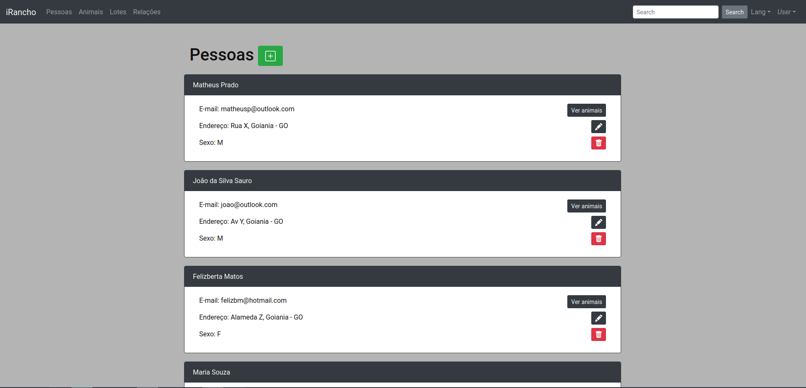
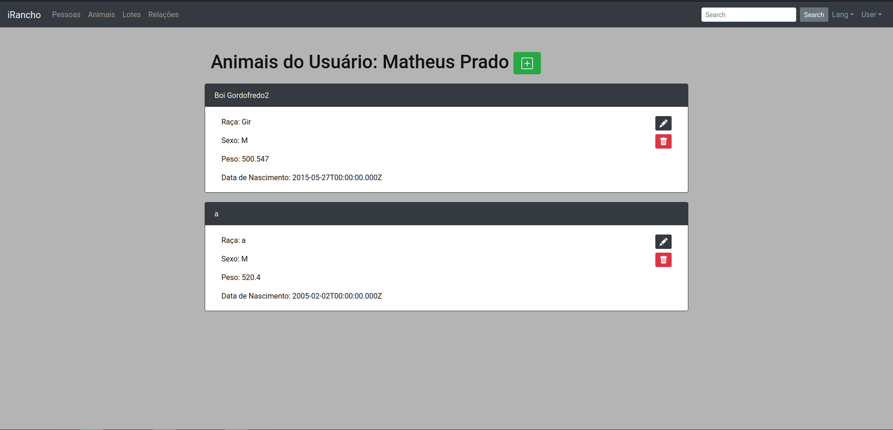
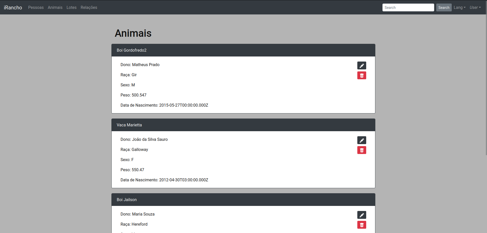
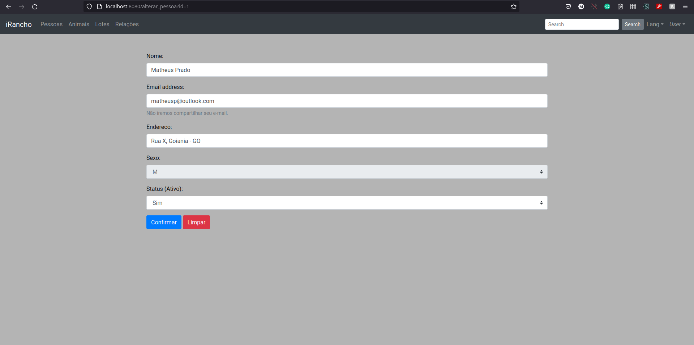

# Desafio CRUD iRancho

Para este desafio foi feita uma API em Node.js, com Express e Sequelize, que é acessada por um app Vue.js, com Bootstrap, Webpack e SCSS/SASS.

### Tela Listar Pessoa

 
Esta tela obtêm as informações de todas as pessoas cadastradas através da API, e fornece as opções de visualizar todos os animais daquele usuário, alterar os dados do usuário e excluir o usuário.
 
### Tela Listar Animais do Usuário

 
Nesta tela é possível visualizar todos os animais cadastrados para um usuário específico. Note também que somente por essa tela é possível adicionar animais, traduzindo a ideia de que cada animal necessita de um dono.
 
### Tela Listar Animais

 
Nesta tela é possível visualizar todos os animais, alterar seus dados e excluí-los, mas não adicioná-los, conforme explicado acima.
 
### Tela Alterar Pessoa

 
Este formulário obtém os dados da pessoa que se deseja alterar, e os carrega previamente nos componentes da tela, facilitando a edição apenas daquilo que se deseja mudar. Ele apresenta um botão para limpar a tela, caso o usuário deseje alterar todos os dados possíveis (aqueles não desabilitados). As telas de cadastro seguem o mesmo formato, exceto que não trazem dados pré-carregados.

Para rodar o Cliente:
``` bash
npm install
npm run dev
```

Para rodar o Servidor/API:
``` bash
npm install
nodemon server.js
```
