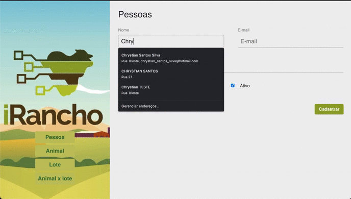

# Desafio IRancho.

## Objetivo

Este desafio continha o objetivo de desenvolver uma aplicação onde teria as seguintes entidades:

### PESSOA, ANIMAL, LOTE, LOTExANIMAL.
&nbsp;

## Stacks utilizada no desafio:

### Front
- React com TS
- Styled-components
- Axios
- Unform

### Back

- Node com TS
- Class-transformer
- Express
- Tsyringe
- Typeorm
- Redis

### Database

- Postgres
- Redis

## Demo




## Rodar na sua máquina:

Crie os seguinte containers com docker:


```bat
docker run --name redis -p 6379:6379 -d -t redis:alpine

docker run --name desafio_rancho -e POSTGRES_PASSWORD=postgres -p 5432:5432 -d postgres
```
Apos criarmos o container Postgres, iremos criar uma database com o nome "desafio_rancho"

Em seguida baixaremos o projeto, e executaremos os seguintes comandos:

```bat
cd back
yarn
yarn dev:server
```
```bat
cd front
yarn
yarn start
```