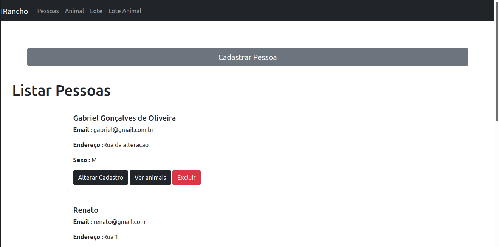
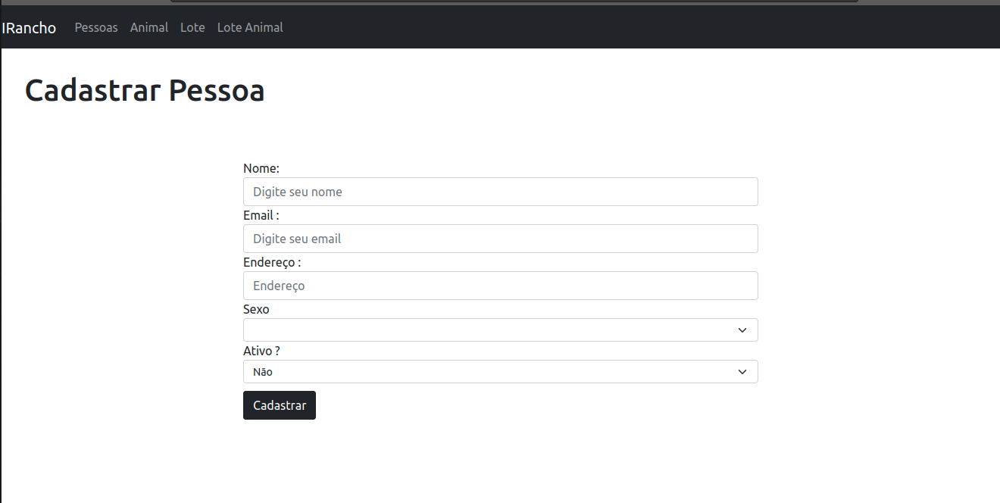
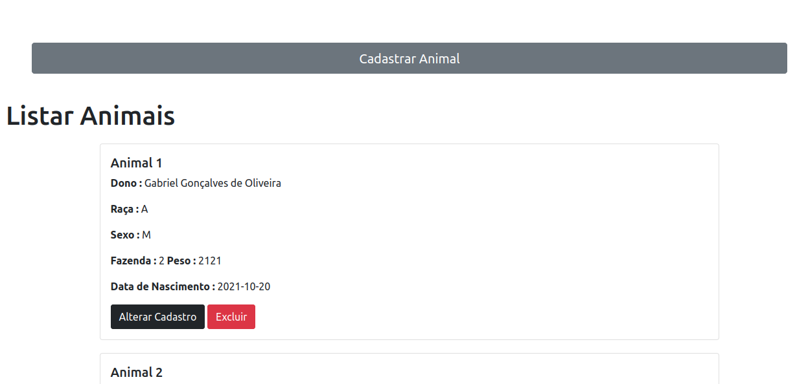
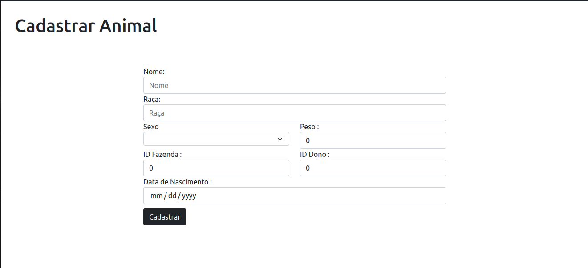
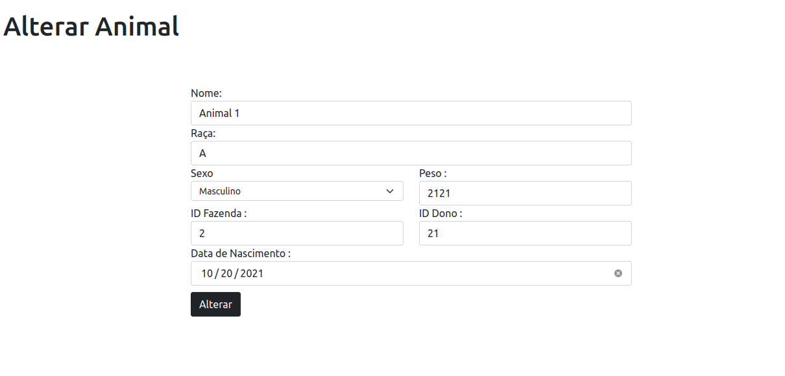
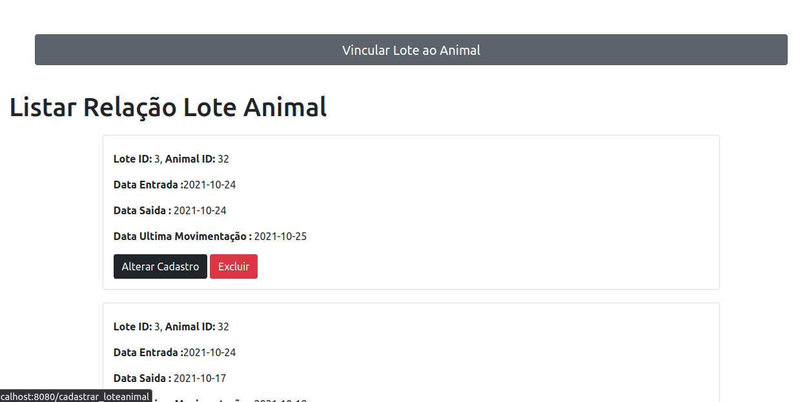

# I-Rancho CRUD
 
 
### Tela Listar Pessoa

 
A tela *listar pessoas* obtêm as informações de todas as pessoas cadastradas no BD e fornece a opção de visualizar todos os animais daquele usuário, alterar usuário e excluir usuário.
 
### Tela Cadastrar Pessoa

 
Formulário para cadastrar pessoas.
 
### Tela Listar Animais

 
A tela *listar Animais* obtêm todos os animais cadastrados no BD juntamente com as informações de seu dono.
 
### Tela Cadastrar Animais

 
Formulário para cadastrar pessoas.
 
### Tela Alterar Animais

 
O formulário obtém todos os dados de um Animal X e preenche os campos automaticamente, assim o usuário altera somente os campos que sejam convenientes.
 
### Tela Relação Lote Animais
 


OBS: As telas que não foram inseridas aqui são similares as telas já inseridas.

Para rodas ambos os projetos :
``` bash
npm install
npm run dev
```
